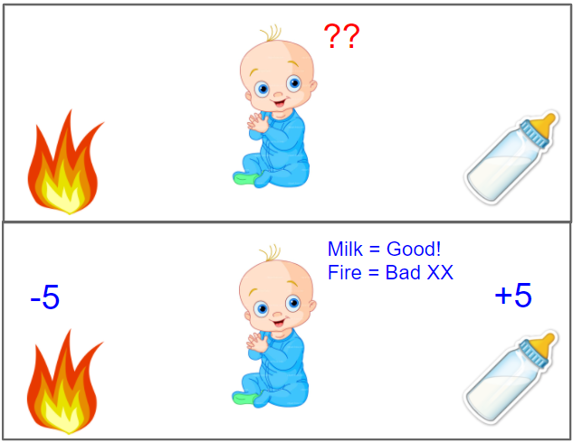

# Introduction

When we have to write a computer program the **Traditional approach** relies on us to write specific instructions for every specific task. In recent years another approach has grown in popularity the so called **Machine Learning** it is very different from the traditional one and it enables machines to autonomously find an algorithm based on examples it has seen.

## How does Humans Learn?

Here we can see an example of a baby that needs to find out if touching the fire is good or bad. It does so by interacting with the environment. Infants have no explicit teacher but direct sensorimotor connection to the environment.
Exercising this connection produces information about:

- cause-effect relationships (consequences of actions)
- what to do to achieve goals

Other Examples of Learning from Interaction may include: Learning to drive a car or Learning to hold a conversation.

## Reinforcement Learning

Reinforcement Learning is a computational approach to learning from interaction. More precisely in Reinforcement Learning we build algorithms that learn:

- what to do so as to maximize a numerical reward signal (a factor that measures how good we are doing)
- how to map situations to actions

The two most important features of RL are:

- **Trial-and-error search**: The learner is not told which action to take in each situation (as in supervised learning) but it must discover which action yields the most reward by trying them
- **Delayed reward**: Actions may affect not only the immediate reward but also the next situation and, through that, all subsequent rewards.

A key challenge in RL is the optimization of the trade-off between exploration and exploitation.

- **Exploration:** means selecting the action you never tried to evaluate it
- **Exploitation:** means selecting actions already tried in the past and found to be effective in producing reward

Before I've said that there is a trade-off that's because the objective of the agent is to maximize the reward, so the most logical thing to do would be to exploit already known actions, but by doing so it might miss out some actions that might be more valuable in terms of reward. On the other hand if it only explores it will never reach the maximum reward.
The process of finding the perfect sweep spot between exploration and exploitation is called the 
**Exploration-Exploitation dilemma** and it's still an unsolved problem.

## Elements of Reinforcement Learning

1. **Policy:** defines the agent’s way of behaving at a given time and in a given situation
2. **Reward signal:** defines the goal of the RL problem, at each step the environment sends to the agent a single number called reward (i.e., immediate pleasure/pain)
3. **Value function:** specifies what is good in the long run (while the reward focuses on what is good immediately)
4. **Model of the environment:** is a mathematical model that mimics the behavior of the environment and allows to infer it. 

# Multi-Armed-Bandit

Reinforcement Learning distinguishes from other types of learning by two main factors:

- RL uses training information to evaluate agent’s actions
- Other learning methods instruct the agent providing examples of correct actions
