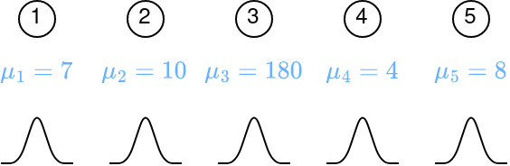

# Introduction

When we have to write a computer program the **Traditional approach** relies on us to write specific instructions for every specific task. In recent years another approach has grown in popularity the so called **Machine Learning** it is very different from the traditional one and it enables machines to autonomously find an algorithm based on examples it has seen.

## How does Humans Learn?

Here we can see an example of a baby that needs to find out if touching the fire is good or bad. It does so by interacting with the environment. Infants have no explicit teacher but direct sensorimotor connection to the environment.
Exercising this connection produces information about:

- cause-effect relationships (consequences of actions)
- what to do to achieve goals

Other Examples of Learning from Interaction may include: Learning to drive a car or Learning to hold a conversation.

## Reinforcement Learning

Reinforcement Learning is a computational approach to learning from interaction. More precisely in Reinforcement Learning we build algorithms that learn:

- what to do so as to maximize a numerical reward signal (a factor that measures how good we are doing)
- how to map situations to actions

The two most important features of RL are:

- **Trial-and-error search**: The learner is not told which action to take in each situation (as in supervised learning) but it must discover which action yields the most reward by trying them
- **Delayed reward**: Actions may affect not only the immediate reward but also the next situation and, through that, all subsequent rewards.

A key challenge in RL is the optimization of the trade-off between exploration and exploitation.

- **Exploration:** means selecting the action you never tried to evaluate it
- **Exploitation:** means selecting actions already tried in the past and found to be effective in producing reward

Before I've said that there is a trade-off that's because the objective of the agent is to maximize the reward, so the most logical thing to do would be to exploit already known actions, but by doing so it might miss out some actions that might be more valuable in terms of reward. On the other hand if it only explores it will never reach the maximum reward.
The process of finding the perfect sweep spot between exploration and exploitation is called the 
**Exploration-Exploitation dilemma** and it's still an unsolved problem.

## Elements of Reinforcement Learning

1. **Policy:** defines the agent’s way of behaving at a given time and in a given situation
2. **Reward signal:** defines the goal of the RL problem, at each step the environment sends to the agent a single number called reward (i.e., immediate pleasure/pain)
3. **Value function:** specifies what is good in the long run (while the reward focuses on what is good immediately)
4. **Model of the environment:** is a mathematical model that mimics the behavior of the environment and allows to infer it. 

# Multi-Armed-Bandit

Multi-Armed Bandit is a Reinforcement Learning Problem useful to evaluate some aspects of RL in the simplified setting of single state (**nonassociative setting**)

## K-armed Bandit Problem

|                        k-armed bandit                        |                        1-armed bandit                        |
| :----------------------------------------------------------: | :----------------------------------------------------------: |
|  |  |

The problem of the k armed bandit is a stochastic problem in which you have repeatedly to choose among k different options (actions) after each choice you receive a numerical reward chosen from a stationary probability distribution depending on the action selected. The most simple setting is the one armed bandit problem which is analogous to a slot machine.

maximize the expected total reward over some time period (e.g. 1000 action selections)

**Example**

$$
\mathcal{A}=\{1,2,3,4,5\}
$$
In this example we have 5 actions (from 1 to 5) each action has a stationary probability distribution over reward, this distribution can be approximated single value the expected (mean) reward ($\mu$), this value is also called **value of the action**.

If $A_t$ is the action selected at step $t$ and $R_t$ is the corresponding reward then the expected reward given that action a was selected is:
$$
q_*(a)\doteq\mathbb{E}[R_t|A_t=a]
$$
If you **know the value of each action** then it is trivial to solve the k-armed bandit problem: **always select the action with the highest value**. 

The problem is that **we don't really know the value of each action** so we need to find a way to **estimate** it, to do so we can explore, but remember that we have a limited time so in this time we need **both** to **explore** (i.e learn the values) and to **exploit** (i.e exploit the accumulated knowledge maximize the expected total reward).

The estimated value of action a at time t is $Q_t(a)$, we would like it to be as close as possible to $q_*(a)$ (i.e the real value)
$$
\lim_{t\to\infty}Q_t(a)=q_*(a)
$$
Given estimates of all action values, we call **greedy action** the action with the **largest estimated value**.

- When you choose the **greedy action** you **exploit** your current knowledge of action value
- When you choose **nongreedy actions** you **explore** action values to get new knowledge on them

- **Exploitation**: is the best thing to do to maximize the expected reward on a one step horizon.
- **Exploration**: may produce greater total reward in the long run.
- **Dilemma**: should I explore or exploit? There is a conflict

## Methods for Estimating Q-Value

### Sample Average Reward

Since the value of an action is the mean reward obtained when the action is selected, a natural way to estimate it is by averaging the rewards actually received:
$$
Q_t\doteq \frac{\sum^{t-1}_{i=1}R_i*\mathbb{1}_{A_i=a}}{\sum^{t-1}_{i=1}\mathbb{1}_{A_i=a}}=\frac{sum\; of\; rewards\; from\; taking\; a}{number\; of\;times\;a \;taken }\\\\
\mathbb{1}_{A_i=a}= 
\begin{cases}
    1,& \text{if } A_i=a\\
    0,              & \text{otherwise}
\end{cases}
$$

by the law of large numbers as $t$ goes to infinity $Q_t(a)$ converges to $q_*(a)$ 

**How does this estimate can be used?**

1. **Greedy Action Selection:** Select action with highest estimated value $\underset{a}{\mathrm{argmax}}\;Q_t(a)$ this method always exploits (i.e maximizes immediate reward)
2. **Alternative rule:** behave greedy most of the time but with small prob $\epsilon$ select randomly from nongreedy actions. This method is called $\epsilon-greedy$. It performs exploration. As the number of steps increases, every action will be sampled infinite number of times ensuring that $Q_t(a)$ converges to $q_*(a)$ 

## The 10-armed Testbed

The 10-armed testbed is a method to compare performance of different learning methods
